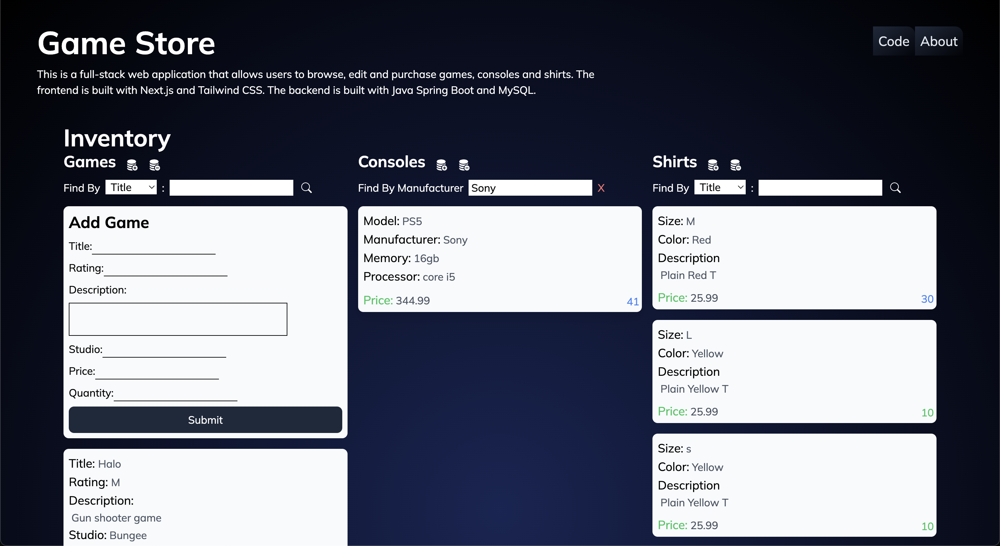

# Full Stack Game Store
<!-- image in .md -->

## Description
This is a front end I implemented on top of the backend my group built for the final project of the Netflix Pathways Bootcamp. It uses Spring, React, MySql, and Java JPA to manage an inventory for a game store.

the front end is a work in progress. The backend is fully functional and implements all CRUD operations, Querying with GraphQL, and JPA. 
## See Netflix Pathways Final Project  [README](https://github.com/mpughcs/Final-Project-MP-AO-DO-FO)

## Technologies Used
### Backend
* Java
* Spring Boot
* MySql
* Java JPA
* GraphQL
### Frontend
* React
* Javascript
* Tailwind CSS

## How to Run
1. Clone the repository
2. Open the project in your IDE
3. Run the backend
4. Run the frontend
5. Navigate to localhost:3000 in your browser
