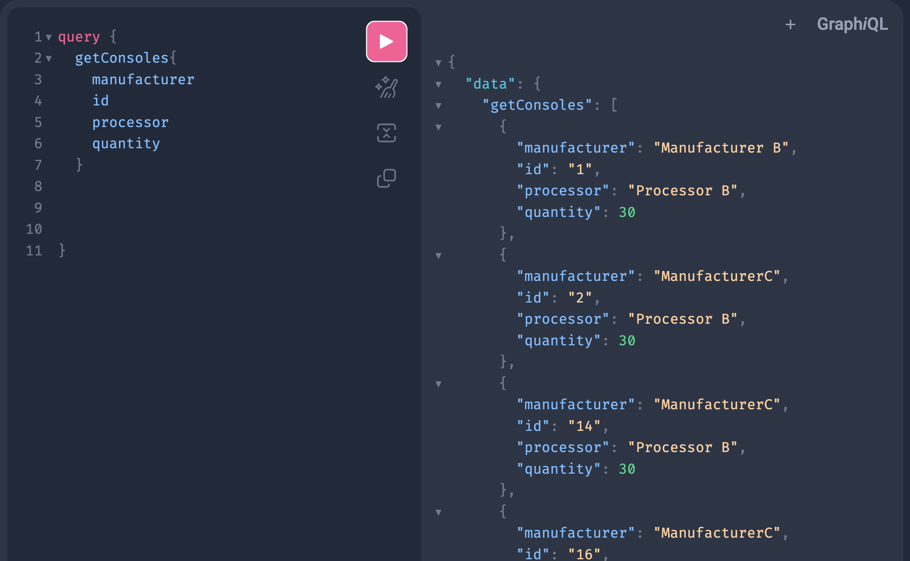
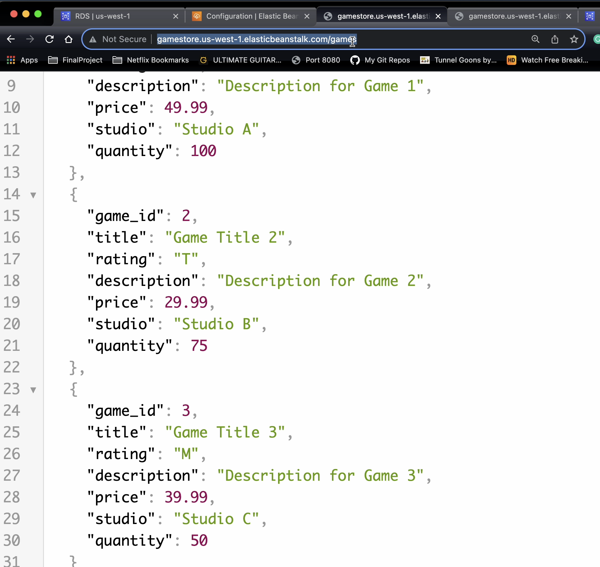
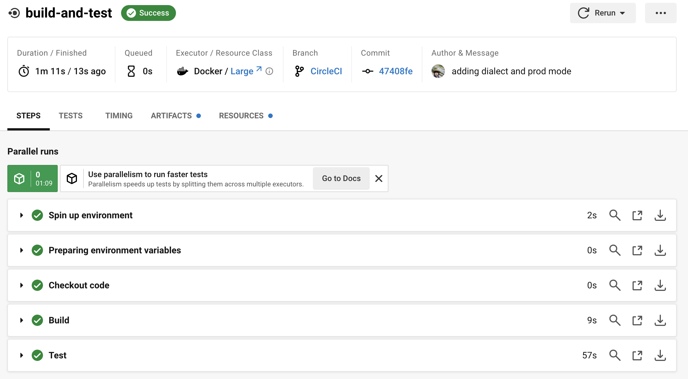
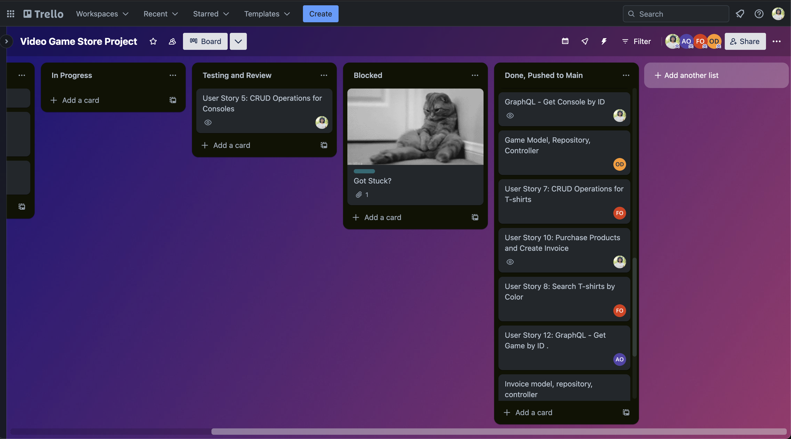

# Game Store API
## Description
This projects implements a game store inventory using Java JPA, Spring boot,
MySQL, and Maven. 

* [Game Store API](#game-store-api)
  * [Description](#description)
  * [Technologies](#technologies)
  * [Features](#features)
    * [Game](#game)
    * [Console](#console)
    * [T-Shirt](#t-shirt)
    * [Invoice](#invoice)
  * [GraphQL](#graphql)
  * [Deployment](#deployment)
  * [How to run](#how-to-run)
  * [Members](#Contributions)
## Features
### Game
- User can create, read, update, and delete games
- User can find game by title
- User can find game by ESRB rating
- User can find game by studio

### Console
- User can create, read, update, and delete consoles.
- User can find console by manufacturer

### T-Shirt
- User can create, read, update, and delete t-shirts.
- User can find t-shirt by color

### Invoice
- User can create, read, and delete invoices.
- User can find Invoice By Customer Name
- Invoice has a post endpoint that accepts a view model object and generates an invoice.

## GraphQL:
- User can query to get all Games, as well as by ID, Title, ESRB Rating, and Studio.
- User can query to get all Consoles, as well as by ID and Manufacturer.  




## Deployment
    Deployed to AWS RDS and Elastic Beanstalk
  
## CI/CD
    Ensured smooth releases by using a CI/CD pipeline with CircleCI


 *Note*: To view CI/CD pipeline, please visit the CircleCI branch


# How to run
### Prerequisites
- Java 11
- Maven
- MySQL
- IntelliJ
### Instructions
1. Clone the repository
    ```
    git clone https://github.com/mpughcs/Final-Project-MP-AO-DO-FO.git
    ```
2. Open the project in IntelliJ
3. Navigate to the 'pom.xml' file and right click it
4. Select 'Add as Maven Project'
5. Open MySQL Workbench and connect to your local instance
6. Run the following SQL script to create the database
    ```
    drop database if exists game_store;
    create database game_store;
    use game_store;
    
    create table game (
    game_id int primary key auto_increment,
    title varchar(50) not null,
    esrb_rating varchar(50) not null,
    description varchar(255) not null,
    price decimal(5, 2) not null,
    studio varchar(50) not null,
    quantity int
    );
    
    create table console (
    console_id int primary key auto_increment,
    model varchar(50) not null,
    manufacturer varchar(50) not null,
    memory_amount varchar(20),
    processor varchar(20),
    price decimal(5, 2) not null,
    quantity int not null
    );
    
    create table tshirt (
    tshirt_id int primary key auto_increment,
    size varchar(20) not null,
    color varchar(20) not null,
    description varchar(255) not null,
    price decimal(5,2) not null,
    quantity int not null
    );
    
    create table invoice (
    invoice_id int primary key auto_increment,
    name varchar(50) not null,
    street varchar(100) null,
    city varchar(50) not null,
    state varchar(20) not null,
    zipcode varchar(10) null,
    item_type varchar(50) not null,
    item_id int not null, -- links to either game, console, or t_shirt ids
    unit_price decimal(8,2) not null,
    quantity int not null,
    subtotal decimal(8,2) not null,
    tax decimal(8,2) not null,
    processing_fee decimal(8,2) not null,
    total decimal(8,2) not null
    );
    
    create table fee (
    product_type varchar(50) primary key,
    fee decimal(8,2) not null
    );
    
    create table tax (
    state char(2) primary key,
    rate decimal(8,2) not null
    );
    ```
7. Repeat step 6 and replace 'game_store' with 'game_store_test'
8. Run the following SQL script for both databases
    ```
    use game_store;
    insert into tax (state, rate) values 
    ('AL', .05),
    ('AK', .06),
    ('AZ', .04),
    ('AR', .06),
    ('CA', .06),
    ('CO', .04),
    ('CT', .03),
    ('DE', .05),
    ('FL', .06),
    ('GA', .07),
    ('HI', .05),
    ('ID', .03),
    ('IL', .05),
    ('IN', .05),
    ('IA', .04),
    ('KS', .06),
    ('KY', .04),
    ('LA', .05),
    ('ME', .03),
    ('MD', .07),
    ('MA', .05),
    ('MI', .06),
    ('MN', .06),
    ('MS', .05),
    ('MO', .05),
    ('MT', .03),
    ('NE', .04),
    ('NV', .04),
    ('NH', .06),
    ('NJ', .05),
    ('NM', .05),
    ('NY', .06),
    ('NC', .05),
    ('ND', .05),
    ('OH', .04),
    ('OK', .04),
    ('OR', .07),
    ('PA', .06),
    ('RI', .06),
    ('SC', .06),
    ('SD', .06),
    ('TN', .05),
    ('TX', .03),
    ('UT', .04),
    ('VT', .07),
    ('VA', .06),
    ('WA', .05),
    ('WV', .05),
    ('WI', .03),
    ('WY', .04);
    
    
    insert into fee (product_type, fee) values 
    ('Console', 14.99),
    ('T-Shirt', 1.98),
    ('Game', 1.49);  
8. Run the project in intellij  
   **IMPORTANT**: For desired functionality, please enter data into the database using Insomnia rather
   than querying to avoid primary key errors.
9. For api documentation, see the .yaml file in the project directory
### Contributions
Frankie Ortiz, Max Pugh, Abena Aboagyewaa Ofosu, Okeke Duke

Project Managed with Trello:


 